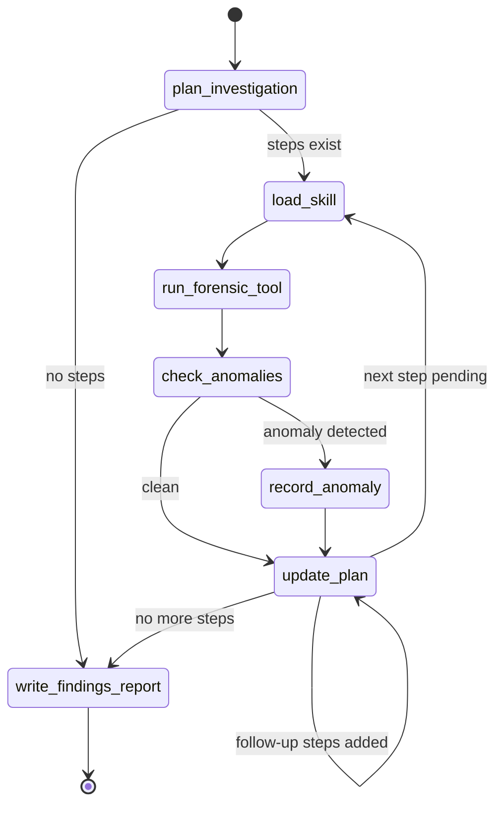

# Valravn — Architecture

## Overview

Valravn is a LangGraph `StateGraph` that drives autonomous DFIR investigations on a SANS SIFT workstation. The graph compiles once per run and executes a directed loop over forensic tool invocations until all planned steps are complete (or exhausted), then produces a findings report.

```
START
  │
  ▼
plan_investigation ──────────────────────────────────────► write_findings_report ► END
  │ (steps exist)                                              ▲
  ▼                                                            │ (no more steps)
load_skill                                                     │
  │                                                      update_plan ◄──────────────────┐
  ▼                                                            │ (next step)             │
run_forensic_tool                                              ▼                         │
  │                                                       load_skill                     │
  ▼                                                                                      │
check_anomalies                                                                          │
  │ (anomaly)                        │ (clean)                                           │
  ▼                                  ▼                                                   │
record_anomaly ──────────────► update_plan ────────────────────────────────────────────-┘
```

---

## State Diagram



---

## Nodes

### `plan_investigation`

**File**: `src/valravn/nodes/plan.py`

Calls Claude (`claude-opus-4-6`) with a structured-output prompt to convert the investigation prompt and evidence paths into an ordered list of `PlannedStep` objects. Each step has a `skill_domain`, a concrete `tool_cmd` (subprocess argv), and a `rationale`.

The resulting `InvestigationPlan` is persisted immediately to `analysis/investigation_plan.json` so it is available for human review even if the run fails mid-way.

**Routing**: If the plan has no steps (empty evidence or trivial prompt), routes directly to `write_findings_report`. Otherwise advances to `load_skill`.

---

### `load_skill`

**File**: `src/valravn/nodes/skill_loader.py`

Reads the SKILL.md file for the current step's `skill_domain` from `~/.claude/skills/<domain>/SKILL.md` and caches it in `AgentState.skill_cache`. Subsequent steps in the same domain reuse the cached content.

Raises `SkillNotFoundError` if the domain is unregistered or the file is missing. Supported domains:

| Domain | SKILL.md location |
|--------|-------------------|
| `memory-analysis` | `~/.claude/skills/memory-analysis/SKILL.md` |
| `sleuthkit` | `~/.claude/skills/sleuthkit/SKILL.md` |
| `windows-artifacts` | `~/.claude/skills/windows-artifacts/SKILL.md` |
| `plaso-timeline` | `~/.claude/skills/plaso-timeline/SKILL.md` |
| `yara-hunting` | `~/.claude/skills/yara-hunting/SKILL.md` |

---

### `run_forensic_tool`

**File**: `src/valravn/nodes/tool_runner.py`

Executes `step.tool_cmd` via `subprocess.run` with a 1-hour timeout. On failure it asks Claude for a corrected command (`_CorrectionSpec`) and retries, up to `max_attempts` times (default: 3).

Per attempt it writes:
- `analysis/<uuid>.stdout` — raw stdout
- `analysis/<uuid>.stderr` — raw stderr
- `analysis/<uuid>.record.json` — `ToolInvocationRecord` metadata

**Evidence guard**: Before the first attempt, the node verifies that no output path is inside an evidence directory. This prevents accidental writes to case evidence.

**Retry / self-correction loop**:
1. Execute tool.
2. On success (`exit_code == 0`) → mark `_step_succeeded = True`, break.
3. On failure and not last attempt → call Claude for a corrected command, record `SelfCorrectionEvent`, retry.
4. On last attempt failure → mark `_step_exhausted = True`, record `ToolFailureRecord`.

---

### `check_anomalies`

**File**: `src/valravn/nodes/anomaly.py`

Reads the most recent tool invocation's stdout (capped at 50 000 bytes) and asks Claude to classify it into one of five anomaly categories:

| Category | Description |
|----------|-------------|
| `timestamp_contradiction` | Implausible or conflicting timestamps |
| `orphaned_relationship` | Process or object with no valid parent |
| `cross_tool_conflict` | Findings contradict results from another tool |
| `unexpected_absence` | Expected artifacts entirely missing |
| `integrity_failure` | Hash mismatches, corrupted records, truncated data |

**Trust-Based Filtering:**
The node integrates with the self-assessment trust coefficient to filter anomalies based on confidence:

- **Trust < 0.3:** Non-critical anomalies are filtered (timestamp_contradiction, orphaned_relationship, cross_tool_conflict, unexpected_absence)
- **Critical anomalies (`integrity_failure`):** Always pass regardless of trust level (hash mismatches, corrupted records cannot be ignored)
- **Trust builds:** Over investigation phases (warmup → ramp up → full strength → anneal)

This prevents low-confidence false positives from derailing investigations while ensuring critical integrity issues are always escalated.

Sets `_pending_anomalies = True` if an anomaly is detected; otherwise routes to `update_plan`.

---

### `record_anomaly`

**File**: `src/valravn/nodes/anomaly.py`

Persists the detected anomaly to `analysis/anomalies.json` and queues a follow-up `PlannedStep` (using `strings -n 20 <evidence>` as a safe default). A depth cap of 3 pending follow-up steps prevents runaway anomaly chaining.

---

### `update_plan`

**File**: `src/valravn/nodes/plan.py`

Marks the current step as `COMPLETED`, `FAILED`, or `EXHAUSTED`; appends any follow-up steps; advances `current_step_id` to the next pending step. Persists the updated plan to disk.

**Routing**: If a next pending step exists → `load_skill`. Otherwise → `write_findings_report`.

---

### `write_findings_report`

**File**: `src/valravn/nodes/report.py`

Assembles a `FindingsReport` from accumulated state (conclusions, anomalies, tool failures, self-corrections) and writes two output files to `reports/`:

- `<timestamp>_<slug>.md` — human-readable Markdown report
- `<timestamp>_<slug>.json` — machine-readable JSON for downstream evaluation

Exit code is `0` if no tool failures occurred, `1` otherwise.

---

## State

**File**: `src/valravn/state.py`

`AgentState` is a `TypedDict` passed between all nodes. LangGraph merges partial dicts returned by each node into the accumulated state.

Key fields:

| Field | Type | Description |
|-------|------|-------------|
| `task` | `InvestigationTask` | Original prompt + evidence refs |
| `plan` | `InvestigationPlan` | Ordered steps with status tracking |
| `invocations` | `list[ToolInvocationRecord]` | All tool runs, all attempts |
| `anomalies` | `list[Anomaly]` | Detected anomalies |
| `report` | `FindingsReport \| None` | Final report (set by last node) |
| `skill_cache` | `dict[str, str]` | Domain → SKILL.md content |
| `_step_succeeded` | `bool` | Inter-node signal: last step succeeded |
| `_step_exhausted` | `bool` | Inter-node signal: last step exhausted retries |
| `_pending_anomalies` | `bool` | Inter-node signal: anomaly waiting to be recorded |

---

## Persistence

| Artifact | Mechanism | Location |
|----------|-----------|----------|
| AgentState checkpoints | LangGraph `SqliteSaver` | `analysis/checkpoints.db` |
| LLM + tool event trace | `FileTracer` (JSONL) | `analysis/traces/<run-id>.jsonl` |
| Investigation plan | JSON (written after each update) | `analysis/investigation_plan.json` |
| Tool stdout/stderr | Plain text files | `analysis/<uuid>.stdout/stderr` |
| Anomaly list | JSON | `analysis/anomalies.json` |
| Findings report | Markdown + JSON | `reports/<timestamp>_<slug>.*` |

The SQLite checkpoint enables crash recovery: re-running with the same `thread_id` resumes from the last completed node. Configure automatic cleanup via `config.yaml` to prevent unbounded growth.

### Additional State Fields

| Field | Type | Description |
|-------|------|-------------|
| `_trust_coefficient` | `float` | Self-assessment confidence (0.0-1.0) affecting anomaly filtering |
| `_skills_config` | `SkillsConfig` | Skill path configuration from config.yaml |

### Checkpoint Cleanup

The `CheckpointCleanupPolicy` (Q6) manages database size with configurable constraints:

| Policy | Description | Default |
|--------|-------------|---------|
| `retention_days` | Delete checkpoints older than N days | 7 |
| `max_checkpoints_per_thread` | Keep at most N checkpoints per thread | 1000 |
| `min_checkpoints_per_thread` | Never delete below this threshold | 2 |

Cleanup runs automatically after each investigation (if `auto_cleanup: true`) or manually via `checkpoint_cleanup.cleanup_checkpoints(db_path)`. Database vacuuming (`sqlite3 VACUUM`) can reclaim disk space if fragmentation is a concern.

---

## Data Models

All models use Pydantic v2.

```
InvestigationTask
  └─ id, prompt, evidence_refs, created_at_utc

InvestigationPlan
  └─ task_id, steps: list[PlannedStep], created_at_utc, last_updated_utc

PlannedStep
  └─ id, skill_domain, tool_cmd, rationale, status, invocation_ids

ToolInvocationRecord
  └─ id, step_id, attempt_number, cmd, exit_code, stdout_path, stderr_path,
     started_at_utc, completed_at_utc, duration_seconds, had_output

Anomaly
  └─ id, description, source_invocation_ids, forensic_significance,
     response_action, follow_up_step_ids, detected_at_utc

FindingsReport
  └─ task_id, prompt, evidence_refs, generated_at_utc,
     conclusions, anomalies, tool_failures, self_corrections,
     investigation_plan_path
```

---

## RCL Training System (Post-Investigation Learning)

Valravn includes a **Reinforcement Learning from Compiler Error Reflection** (RCL) training subsystem (Q1-Q5) that learns from failed investigations and evolves the SecurityPlaybook over time.

### Components

| Component | Location | Purpose |
|-----------|----------|---------|
| `SecurityPlaybook` | `src/valravn/training/playbook.py` | Mutable rules/context for investigation guidance |
| `ReplayBuffer` | `src/valravn/training/replay_buffer.py` | Stores failed trajectories for re-attempt |
| `Reflector` | `src/valravn/training/reflector.py` | Diagnoses failures (attribution, root cause, coverage gap) |
| `Mutator` | `src/valravn/training/mutator.py` | Generates playbook mutations with validation |
| `RCLTrainer` | `src/valravn/training/rcl_loop.py` | Orchestrates the learning loop |

### Learning Loop

```
Investigation completes ──► Reflector analyzes failures
                                  │
                                  ▼
                         Mutator generates playbook changes
                                  │
                                  ▼
                         Apply mutations to SecurityPlaybook
                                  │
                                  ▼
                         RetryBuffer re-attempts archived cases
```

**Protected Entries (Q5):** The playbook supports a `protected_ids` field that marks certain rules as immutable. The mutator will raise `ProtectedEntryError` if the LLM attempts to delete protected entries, providing a human-in-the-loop safeguard.

**Feasibility Rules (Q2):** Custom constraints can be registered with the replay buffer to block trajectories that fail domain-specific checks (e.g., "minimum invocations: 3", "no network timeouts") from entering the buffer.

**Archiving (Q1):** Hopeless cases (after max failures) are archived to `abandoned_cases.jsonl` instead of deleted — useful for manual review or future analysis.
