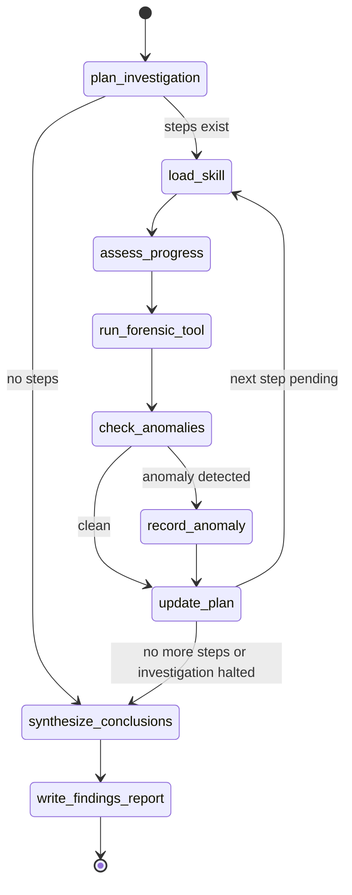

# Code Analysis Fixes — Implementation Plan

> **For agentic workers:** REQUIRED SUB-SKILL: Use superpowers:subagent-driven-development (recommended) or superpowers:executing-plans to implement this plan task-by-task. Steps use checkbox (`- [ ]`) syntax for tracking.

**Goal:** Fix all 29 issues identified in `Code_analysis.md` — logic errors, test gaps, and documentation mismatches — without changing external behavior for correctly-configured deployments.

**Architecture:** Issues are tackled in dependency order: data-model changes first (A-07, A-08), then logic fixes, then test additions, then docs. Each task is self-contained — one commit, tests passing before commit. Run `pytest tests/unit/ -v` after every code change; run `ruff check .` before every commit.

**Tech Stack:** Python 3.12+, LangGraph, Pydantic v2, pytest, ruff, MLflow

---

## File Map

| File | Changes |
|------|---------|
| `src/valravn/training/mutator.py` | A-01: add `parse_llm_json` call |
| `src/valravn/state.py` | A-02: add `_investigation_halted` field |
| `src/valravn/nodes/anomaly.py` | A-02: set halt flag; A-03+A-11: fix follow-up cmds + substitution |
| `src/valravn/graph.py` | A-02: update routing; A-09: explicit `.get()` default |
| `src/valravn/nodes/skill_loader.py` | A-04: guard `next()` |
| `src/valravn/training/replay_buffer.py` | A-05: persist `archived_count` |
| `src/valravn/training/feasibility.py` | A-06: `Path.is_relative_to()` |
| `src/valravn/models/report.py` | A-07: add `evidence_hashes` field |
| `src/valravn/nodes/report.py` | A-07: pass `_evidence_hashes` to report |
| `src/valravn/evaluation/evaluators.py` | A-07: hash comparison in SC-005 |
| `src/valravn/models/task.py` | A-08: add `original_tool_cmd` to `PlannedStep` |
| `src/valravn/config.py` | A-10: log when YAML skipped |
| `src/valravn/core/llm_factory.py` | C-05: remove `DEFAULT_MODELS` |
| `tests/conftest.py` | B-09: shared fixtures |
| `tests/unit/test_llm_factory.py` | B-01: new file |
| `tests/unit/test_parsing.py` | B-02: new file |
| `tests/unit/test_self_assess.py` | B-03: new file |
| `tests/unit/test_anomaly.py` | B-04: consolidate + HALT test |
| `tests/unit/test_anomaly_fix.py` | B-04: delete (merged) |
| `tests/unit/test_evaluators.py` | B-05: hash + deleted evidence tests |
| `tests/unit/test_conclusions.py` | B-06: exact truncation + failed invocations |
| `tests/unit/test_plan_node.py` | B-07: verify JSON file written |
| `tests/unit/test_rcl_loop.py` | B-08: realistic reflector mock |
| `tests/integration/test_graph.py` | B-10: multi-step + empty evidence |
| `docs/architecture.md` | C-01–C-04: diagram + node descriptions |
| `CLAUDE.md` | C-02, C-06, C-07: model default, Python version, env vars |
| `README.md` | C-08: remove duplicate feasibility.py entry |

---

## Task 1: A-01 — Fix `mutator.py` LLM response parsing

**Files:**
- Modify: `src/valravn/training/mutator.py:180-184`
- Test: `tests/unit/test_mutator.py` (existing)

- [ ] **Step 1: Verify the existing test does NOT catch this bug**

```bash
cd /home/sunds/Code/Valravn && source .venv/bin/activate && pytest tests/unit/test_mutator.py -v 2>&1 | head -40
```

Note whether any test calls `apply_mutation()` with a real (non-magic-mocked) LLM path.

- [ ] **Step 2: Write a failing test**

In `tests/unit/test_mutator.py`, add at the end:

```python
from unittest.mock import MagicMock, patch
from langchain_core.messages import AIMessage

def test_apply_mutation_parses_llm_json(tmp_path):
    """apply_mutation must parse the LLM AIMessage response, not assign it directly."""
    playbook = SecurityPlaybook()
    optimizer = OptimizerState()

    llm_json = '{"operation": "NOOP", "entry_id": "", "rule": "", "rationale": ""}'

    with patch("valravn.training.mutator._get_mutator_llm") as mock_factory:
        mock_llm = MagicMock()
        mock_llm.invoke.return_value = AIMessage(content=llm_json)
        mock_factory.return_value = mock_llm

        # Should not raise AttributeError
        apply_mutation(playbook, optimizer, iteration=1, diagnostic_text="test diag")

    # NOOP means no entries added
    assert len(playbook.entries) == 0
```

Check that `SecurityPlaybook`, `OptimizerState`, `apply_mutation` are already imported at the top of the test file; add any missing imports.

- [ ] **Step 3: Run to confirm failure**

```bash
pytest tests/unit/test_mutator.py::test_apply_mutation_parses_llm_json -v
```

Expected: `FAILED` — `AttributeError: 'AIMessage' object has no attribute 'operation'`

- [ ] **Step 4: Fix `mutator.py`**

Replace lines 180–184 in `src/valravn/training/mutator.py`:

```python
    try:
        response = _get_mutator_llm().invoke(messages)
        spec = parse_llm_json(response.content, MutationSpec)
    except Exception as e:
        logger.error("LLM invocation failed during mutation: {}", e)
        raise InvalidMutationError(f"LLM failed to produce valid mutation spec: {e}") from e
```

Add to the imports at the top of `mutator.py` (after the existing imports):

```python
from valravn.core.parsing import parse_llm_json
```

- [ ] **Step 5: Run test to confirm pass**

```bash
pytest tests/unit/test_mutator.py -v
```

Expected: all PASS

- [ ] **Step 6: Lint and commit**

```bash
ruff check src/valravn/training/mutator.py
git add src/valravn/training/mutator.py tests/unit/test_mutator.py
git commit -m "fix: parse LLM response in apply_mutation instead of direct assignment (A-01)"
```

---

## Task 2: A-02 — Implement `INVESTIGATION_HALT` routing

**Files:**
- Modify: `src/valravn/state.py`
- Modify: `src/valravn/nodes/anomaly.py:156-204`
- Modify: `src/valravn/graph.py:61-74` (routing) and `initial_state`
- Test: `tests/unit/test_anomaly.py` (will be done in Task 15; write a placeholder test here)

- [ ] **Step 1: Add `_investigation_halted` to `AgentState`**

In `src/valravn/state.py`, add one line after `_follow_up_steps`:

```python
    _follow_up_steps: list[PlannedStep]
    _investigation_halted: bool
```

- [ ] **Step 2: Initialize in `graph.py` `initial_state`**

In `src/valravn/graph.py`, add after `"_follow_up_steps": [],`:

```python
        "_investigation_halted": False,
```

- [ ] **Step 3: Set the flag in `record_anomaly()`**

In `src/valravn/nodes/anomaly.py`, replace the `return` statement at line 200:

```python
    return {
        "anomalies": updated_anomalies,
        "_follow_up_steps": follow_up_steps,
        "_pending_anomalies": False,
        "_investigation_halted": anomaly.response_action == AnomalyResponseAction.INVESTIGATION_HALT,
    }
```

- [ ] **Step 4: Update `route_next_step()` in `graph.py`**

Replace the existing `route_next_step` function:

```python
    def route_next_step(state: AgentState) -> str:
        if state.get("_investigation_halted", False):
            return "synthesize_conclusions"
        if state["plan"].next_pending_step() is not None:
            return "load_skill"
        return "synthesize_conclusions"
```

- [ ] **Step 5: Write a test**

In `tests/unit/test_anomaly.py` (or a new temp file — this will be consolidated in Task 15), add:

```python
def test_record_anomaly_sets_investigation_halted(read_only_evidence, output_dir):
    data = {
        "anomaly_detected": True,
        "description": "Cannot recover",
        "forensic_significance": "critical",
        "category": "integrity_failure",
        "response_action": "investigation_cannot_proceed",
    }
    from valravn.models.task import InvestigationTask, InvestigationPlan, PlannedStep
    task = InvestigationTask(prompt="Test", evidence_refs=[str(read_only_evidence)])
    plan = InvestigationPlan(task_id=task.id, steps=[
        PlannedStep(skill_domain="sleuthkit", tool_cmd=["fls", str(read_only_evidence)], rationale="r")
    ])
    state = {
        "task": task,
        "plan": plan,
        "anomalies": [],
        "_detected_anomaly_data": data,
        "_last_invocation_id": "inv-001",
        "_output_dir": str(output_dir),
        "current_step_id": plan.steps[0].id,
    }
    result = record_anomaly(state)
    assert result["_investigation_halted"] is True
    assert result["_follow_up_steps"] == []
```

- [ ] **Step 6: Run tests**

```bash
pytest tests/unit/ -v -k "anomaly"
```

Expected: all PASS

- [ ] **Step 7: Lint and commit**

```bash
ruff check src/valravn/state.py src/valravn/nodes/anomaly.py src/valravn/graph.py
git add src/valravn/state.py src/valravn/nodes/anomaly.py src/valravn/graph.py tests/unit/test_anomaly.py
git commit -m "fix: implement INVESTIGATION_HALT routing to stop graph on critical anomaly (A-02)"
```

---

## Task 3: A-03 + A-11 — Fix follow-up commands and template substitution

**Files:**
- Modify: `src/valravn/nodes/anomaly.py:45-66` (`_FOLLOW_UP_COMMANDS`)
- Modify: `src/valravn/nodes/anomaly.py:172-179` (template substitution)
- Test: `tests/unit/test_anomaly.py`

- [ ] **Step 1: Write failing tests**

Add to `tests/unit/test_anomaly.py`:

```python
def test_timestamp_contradiction_followup_has_storage_file(read_only_evidence, output_dir):
    """log2timeline follow-up must include --storage-file (required flag)."""
    from valravn.nodes.anomaly import _FOLLOW_UP_COMMANDS
    cmd_template = _FOLLOW_UP_COMMANDS["timestamp_contradiction"]["tool_cmd_template"]
    assert "--storage-file" in cmd_template

def test_orphaned_relationship_followup_uses_vol_py(read_only_evidence, output_dir):
    """Volatility follow-up must use python3 /opt/volatility3-2.20.0/vol.py, not vol3."""
    from valravn.nodes.anomaly import _FOLLOW_UP_COMMANDS
    cmd_template = _FOLLOW_UP_COMMANDS["orphaned_relationship"]["tool_cmd_template"]
    assert cmd_template[0] != "vol3"
    assert "vol.py" in " ".join(cmd_template)

def test_followup_substitutes_analysis_dir(read_only_evidence, output_dir):
    """Template substitution must replace {analysis_dir} in addition to {evidence}."""
    import json
    from unittest.mock import MagicMock, patch
    from langchain_core.messages import AIMessage

    data = {
        "anomaly_detected": True,
        "description": "timestamp issue",
        "forensic_significance": "high",
        "category": "timestamp_contradiction",
        "response_action": "added_follow_up_steps",
    }
    from valravn.models.task import InvestigationTask, InvestigationPlan, PlannedStep
    task = InvestigationTask(prompt="Test", evidence_refs=[str(read_only_evidence)])
    plan = InvestigationPlan(task_id=task.id, steps=[
        PlannedStep(skill_domain="sleuthkit", tool_cmd=["fls", str(read_only_evidence)], rationale="r")
    ])
    state = {
        "task": task,
        "plan": plan,
        "anomalies": [],
        "_detected_anomaly_data": data,
        "_last_invocation_id": "inv-001",
        "_output_dir": str(output_dir),
        "current_step_id": plan.steps[0].id,
    }
    result = record_anomaly(state)
    assert result["_follow_up_steps"]
    cmd = result["_follow_up_steps"][0].tool_cmd
    # No literal placeholder strings should remain
    assert "{analysis_dir}" not in cmd
    assert "{evidence}" not in cmd
```

- [ ] **Step 2: Run to confirm failures**

```bash
pytest tests/unit/test_anomaly.py::test_timestamp_contradiction_followup_has_storage_file tests/unit/test_anomaly.py::test_orphaned_relationship_followup_uses_vol_py tests/unit/test_anomaly.py::test_followup_substitutes_analysis_dir -v
```

Expected: all FAIL

- [ ] **Step 3: Fix `_FOLLOW_UP_COMMANDS`**

In `src/valravn/nodes/anomaly.py`, replace the `_FOLLOW_UP_COMMANDS` dict (lines 45–66):

```python
_FOLLOW_UP_COMMANDS: dict[str, dict] = {
    "timestamp_contradiction": {
        "skill_domain": "plaso-timeline",
        "tool_cmd_template": [
            "log2timeline.py",
            "--storage-file", "{analysis_dir}/followup_timeline.plaso",
            "--parsers", "mft,usnjrnl",
            "--timezone", "UTC",
            "{evidence}",
        ],
    },
    "orphaned_relationship": {
        "skill_domain": "memory-analysis",
        "tool_cmd_template": [
            "python3", "/opt/volatility3-2.20.0/vol.py",
            "-f", "{evidence}",
            "windows.pstree.PsTree",
        ],
    },
    "cross_tool_conflict": {
        "skill_domain": "sleuthkit",
        "tool_cmd_template": ["fls", "-r", "-m", "/", "{evidence}"],
    },
    "unexpected_absence": {
        "skill_domain": "yara-hunting",
        "tool_cmd_template": ["yara", "-r", "/opt/yara-rules/", "{evidence}"],
    },
    "integrity_failure": {
        "skill_domain": "sleuthkit",
        "tool_cmd_template": ["img_stat", "{evidence}"],
    },
}
```

- [ ] **Step 4: Fix template substitution (A-11)**

In `src/valravn/nodes/anomaly.py`, replace the substitution block (lines 172–179):

```python
            analysis_dir = str(Path(state.get("_output_dir", ".")) / "analysis")
            tool_cmd = [
                evidence_path if part == "{evidence}" else
                analysis_dir if part == "{analysis_dir}" else
                part
                for part in cmd_spec["tool_cmd_template"]
            ]
```

- [ ] **Step 5: Run tests**

```bash
pytest tests/unit/ -v -k "anomaly"
```

Expected: all PASS

- [ ] **Step 6: Lint and commit**

```bash
ruff check src/valravn/nodes/anomaly.py
git add src/valravn/nodes/anomaly.py tests/unit/test_anomaly.py
git commit -m "fix: correct follow-up tool commands and add {analysis_dir} substitution (A-03, A-11)"
```

---

## Task 4: A-04 — Guard `next()` in `skill_loader.py`

**Files:**
- Modify: `src/valravn/nodes/skill_loader.py:25`
- Test: `tests/unit/test_anomaly.py` or new `tests/unit/test_skill_loader.py`

- [ ] **Step 1: Write a failing test**

Create `tests/unit/test_skill_loader.py`:

```python
import pytest
from unittest.mock import patch
from valravn.nodes.skill_loader import load_skill
from valravn.models.task import InvestigationTask, InvestigationPlan, PlannedStep


@pytest.fixture
def base_state(tmp_path, read_only_evidence):
    task = InvestigationTask(prompt="Test", evidence_refs=[str(read_only_evidence)])
    plan = InvestigationPlan(task_id=task.id, steps=[
        PlannedStep(skill_domain="sleuthkit", tool_cmd=["fls", str(read_only_evidence)], rationale="r")
    ])
    return {
        "task": task,
        "plan": plan,
        "skill_cache": {},
        "current_step_id": plan.steps[0].id,
    }


def test_load_skill_raises_value_error_for_missing_step(base_state):
    """load_skill should raise ValueError with a clear message, not StopIteration."""
    base_state["current_step_id"] = "nonexistent-step-id"
    with pytest.raises(ValueError, match="nonexistent-step-id"):
        load_skill(base_state)


def test_load_skill_raises_for_unknown_domain(base_state):
    """load_skill raises SkillNotFoundError for unregistered domain."""
    from valravn.nodes.skill_loader import SkillNotFoundError
    base_state["plan"].steps[0].skill_domain = "unknown-domain"
    with pytest.raises(SkillNotFoundError):
        load_skill(base_state)


def test_load_skill_uses_cache(base_state):
    """load_skill returns cached content without reading the file again."""
    base_state["skill_cache"] = {"sleuthkit": "cached content"}
    result = load_skill(base_state)
    assert result["skill_cache"]["sleuthkit"] == "cached content"
```

- [ ] **Step 2: Run to confirm first test fails**

```bash
pytest tests/unit/test_skill_loader.py::test_load_skill_raises_value_error_for_missing_step -v
```

Expected: FAIL with `StopIteration`

- [ ] **Step 3: Fix `skill_loader.py`**

Replace line 25 in `src/valravn/nodes/skill_loader.py`:

```python
    step = next((s for s in state["plan"].steps if s.id == step_id), None)
    if step is None:
        raise ValueError(
            f"Step {step_id!r} not found in plan "
            f"(known ids: {[s.id for s in state['plan'].steps]})"
        )
```

- [ ] **Step 4: Run all skill_loader tests**

```bash
pytest tests/unit/test_skill_loader.py -v
```

Expected: first two PASS (ValueError and SkillNotFoundError). The cache test will PASS too. Note: `test_load_skill_raises_for_unknown_domain` may PASS without code changes (SkillNotFoundError was already raised for unknown domains).

- [ ] **Step 5: Lint and commit**

```bash
ruff check src/valravn/nodes/skill_loader.py
git add src/valravn/nodes/skill_loader.py tests/unit/test_skill_loader.py
git commit -m "fix: guard next() in skill_loader to raise ValueError instead of StopIteration (A-04)"
```

---

## Task 5: A-05 — Persist `archived_count` in `ReplayBuffer`

**Files:**
- Modify: `src/valravn/training/replay_buffer.py:104-127`
- Test: `tests/unit/test_replay_buffer.py` (existing)

- [ ] **Step 1: Write a failing test**

In `tests/unit/test_replay_buffer.py`, add:

```python
def test_archived_count_survives_save_load(tmp_path):
    """archived_count must be preserved across save/load cycles."""
    archive_file = tmp_path / "archive.jsonl"
    buf = ReplayBuffer(n_pass=3, n_reject=1, archive_path=archive_file)

    buf.add_failure("case-1", {"data": "x"})
    buf.record_outcome("case-1", success=False)  # fails >= n_reject=1 → archived
    assert buf.archived_count == 1

    save_path = tmp_path / "buf.json"
    buf.save(save_path)

    loaded = ReplayBuffer.load(save_path)
    assert loaded.archived_count == 1
```

- [ ] **Step 2: Run to confirm failure**

```bash
pytest tests/unit/test_replay_buffer.py::test_archived_count_survives_save_load -v
```

Expected: FAIL — `assert 0 == 1`

- [ ] **Step 3: Fix `replay_buffer.py`**

In `save()`, add `"archived_count"` to the payload dict:

```python
        payload = {
            "n_pass": self.n_pass,
            "n_reject": self.n_reject,
            "buffer": self.buffer,
            "archive_path": str(self.archive_path) if self.archive_path else None,
            "archived_count": self.archived_count,
        }
```

In `load()`, restore it after `instance.buffer = payload["buffer"]`:

```python
        instance.archived_count = payload.get("archived_count", 0)
```

- [ ] **Step 4: Run tests**

```bash
pytest tests/unit/test_replay_buffer.py -v
```

Expected: all PASS

- [ ] **Step 5: Lint and commit**

```bash
ruff check src/valravn/training/replay_buffer.py
git add src/valravn/training/replay_buffer.py tests/unit/test_replay_buffer.py
git commit -m "fix: persist archived_count in ReplayBuffer save/load (A-05)"
```

---

## Task 6: A-06 — Fix path prefix matching in `feasibility.py`

**Files:**
- Modify: `src/valravn/training/feasibility.py:112-118`
- Test: `tests/unit/test_feasibility.py` (existing)

- [ ] **Step 1: Write failing tests**

In `tests/unit/test_feasibility.py`, add:

```python
def test_evidence_protection_no_false_positive_on_prefix_match():
    """'/mnt/evidence2/file' must NOT match evidence at '/mnt/evidence'."""
    fm = FeasibilityMemory()
    passed, violations = fm.check(
        cmd=["rm", "/mnt/evidence2/file"],
        evidence_refs=["/mnt/evidence"],
        output_dir="/tmp/out",
    )
    assert passed, f"False positive: {violations}"


def test_evidence_protection_blocks_exact_path():
    """'rm /mnt/evidence/disk.img' must be blocked when evidence is '/mnt/evidence/disk.img'."""
    import tempfile, os
    with tempfile.NamedTemporaryFile(delete=False) as f:
        ev_path = f.name
    try:
        fm = FeasibilityMemory()
        passed, violations = fm.check(
            cmd=["rm", ev_path],
            evidence_refs=[ev_path],
            output_dir="/tmp/out",
        )
        assert not passed
    finally:
        os.unlink(ev_path)
```

- [ ] **Step 2: Run to confirm first test fails**

```bash
pytest tests/unit/test_feasibility.py::test_evidence_protection_no_false_positive_on_prefix_match -v
```

Expected: FAIL

- [ ] **Step 3: Fix `feasibility.py`**

Replace `_check_evidence_protection` in `src/valravn/training/feasibility.py`:

```python
    def _check_evidence_protection(self, cmd: list[str], evidence_refs: str) -> tuple[bool, str]:
        """Check that destructive commands do not target evidence paths."""
        if not cmd or not evidence_refs:
            return True, ""
        executable = Path(cmd[0]).name
        if executable not in self._DESTRUCTIVE_CMDS:
            return True, ""
        evidence_list = evidence_refs.split(",") if isinstance(evidence_refs, str) else []
        for arg in cmd:
            arg_path = Path(arg)
            for ev_path_str in evidence_list:
                ev_path_str = ev_path_str.strip()
                if not ev_path_str:
                    continue
                ev_path = Path(ev_path_str)
                try:
                    # Use is_relative_to for precise path prefix matching
                    if arg_path == ev_path or arg_path.is_relative_to(ev_path):
                        return False, (
                            f"Destructive command '{executable}' targets evidence path {ev_path_str}"
                        )
                except (ValueError, OSError):
                    pass
        return True, ""
```

- [ ] **Step 4: Run tests**

```bash
pytest tests/unit/test_feasibility.py -v
```

Expected: all PASS

- [ ] **Step 5: Lint and commit**

```bash
ruff check src/valravn/training/feasibility.py
git add src/valravn/training/feasibility.py tests/unit/test_feasibility.py
git commit -m "fix: use Path.is_relative_to() for evidence path protection instead of startswith (A-06)"
```

---

## Task 7: A-07 — Evidence hash comparison for SC-005

**Files:**
- Modify: `src/valravn/models/report.py` — add `evidence_hashes` field
- Modify: `src/valravn/graph.py` — compute hashes before graph runs, add to `initial_state` and `AgentState`
- Modify: `src/valravn/state.py` — add `_evidence_hashes` field
- Modify: `src/valravn/nodes/report.py` — pass hashes through to `FindingsReport`
- Modify: `src/valravn/evaluation/evaluators.py` — compare hashes in SC-005
- Test: `tests/unit/test_evaluators.py` (existing)

- [ ] **Step 1: Write failing test first**

In `tests/unit/test_evaluators.py`, add:

```python
def test_eval_evidence_integrity_fails_on_modified_content(tmp_path):
    """SC-005 must fail if evidence content changed even if permissions are read-only."""
    import hashlib, stat as stat_mod
    ev = tmp_path / "disk.img"
    ev.write_bytes(b"original content")

    # Record original hash
    h = hashlib.sha256(b"original content").hexdigest()

    # Modify content, then restore read-only
    ev.write_bytes(b"tampered content")
    ev.chmod(0o444)

    report = _make_complete_report(tmp_path)
    report.evidence_refs = [str(ev)]
    report.evidence_hashes = {str(ev): h}  # hash of ORIGINAL content

    assert _eval_evidence_integrity(report) is False


def test_eval_evidence_integrity_passes_with_matching_hash(tmp_path):
    """SC-005 must pass when stored hash matches current content."""
    import hashlib
    ev = tmp_path / "disk.img"
    ev.write_bytes(b"original content")
    ev.chmod(0o444)

    h = hashlib.sha256(b"original content").hexdigest()

    report = _make_complete_report(tmp_path)
    report.evidence_refs = [str(ev)]
    report.evidence_hashes = {str(ev): h}

    assert _eval_evidence_integrity(report) is True
```

Also add `from valravn.evaluation.evaluators import _eval_evidence_integrity` to imports if not present, and check how `_make_complete_report` is defined in the file — use whatever helper already exists, or inline the report construction.

- [ ] **Step 2: Run to confirm failures**

```bash
pytest tests/unit/test_evaluators.py::test_eval_evidence_integrity_fails_on_modified_content -v
```

Expected: FAIL (either `AttributeError: evidence_hashes` or assertion error)

- [ ] **Step 3: Add `evidence_hashes` to `FindingsReport`**

In `src/valravn/models/report.py`, add `Field` to imports and the new field:

```python
from pydantic import BaseModel, Field, field_validator
```

In `FindingsReport`, add after `investigation_plan_path`:

```python
    evidence_hashes: dict[str, str] = Field(default_factory=dict)
```

- [ ] **Step 4: Add `_evidence_hashes` to `AgentState` and `graph.py`**

In `src/valravn/state.py`, add:

```python
    _evidence_hashes: dict[str, Any]
```

In `src/valravn/graph.py`, add the hash helper function before `_build_graph`:

```python
import hashlib

def _hash_evidence_files(evidence_refs: list[str]) -> dict[str, str]:
    """Compute SHA-256 hashes of evidence files at investigation start."""
    hashes: dict[str, str] = {}
    for ref in evidence_refs:
        p = Path(ref)
        if p.exists() and p.is_file():
            h = hashlib.sha256()
            with open(p, "rb") as f:
                for chunk in iter(lambda: f.read(65536), b""):
                    h.update(chunk)
            hashes[ref] = h.hexdigest()
    return hashes
```

In `run()`, add to `initial_state`:

```python
        "_evidence_hashes": _hash_evidence_files(task.evidence_refs),
```

- [ ] **Step 5: Pass hashes through in `write_findings_report`**

In `src/valravn/nodes/report.py`, update the `FindingsReport(...)` constructor call:

```python
    report = FindingsReport(
        task_id=task.id,
        prompt=task.prompt,
        evidence_refs=task.evidence_refs,
        evidence_hashes=state.get("_evidence_hashes") or {},
        conclusions=conclusions,
        anomalies=list(state.get("anomalies") or []),
        tool_failures=tool_failures,
        self_corrections=self_corrections,
        investigation_plan_path=plan_path,
    )
```

- [ ] **Step 6: Update `_eval_evidence_integrity` in `evaluators.py`**

Add a helper and replace the function in `src/valravn/evaluation/evaluators.py`:

```python
import hashlib

def _compute_sha256(path: Path) -> str:
    h = hashlib.sha256()
    with open(path, "rb") as f:
        for chunk in iter(lambda: f.read(65536), b""):
            h.update(chunk)
    return h.hexdigest()


def _eval_evidence_integrity(report: FindingsReport) -> bool:
    """SC-005: no evidence file was modified — each path must exist and its
    SHA-256 must match the hash captured at investigation start.
    Falls back to permission check for legacy reports without stored hashes."""
    for ref in report.evidence_refs:
        p = Path(ref)
        if not p.exists():
            print(
                f"[SC-005 WARNING] Evidence path not found at evaluation time: {p}",
                file=sys.stderr,
            )
            return False
        stored_hash = report.evidence_hashes.get(ref)
        if stored_hash is not None:
            if _compute_sha256(p) != stored_hash:
                return False
        else:
            # Legacy fallback: no hash recorded, check write permissions
            mode = p.stat().st_mode
            if mode & (stat.S_IWUSR | stat.S_IWGRP | stat.S_IWOTH):
                return False
    return True
```

- [ ] **Step 7: Run all tests**

```bash
pytest tests/unit/ -v
```

Expected: all PASS

- [ ] **Step 8: Lint and commit**

```bash
ruff check src/valravn/models/report.py src/valravn/graph.py src/valravn/state.py src/valravn/nodes/report.py src/valravn/evaluation/evaluators.py
git add src/valravn/models/report.py src/valravn/graph.py src/valravn/state.py src/valravn/nodes/report.py src/valravn/evaluation/evaluators.py tests/unit/test_evaluators.py
git commit -m "fix: implement SHA-256 hash comparison for SC-005 evidence integrity check (A-07)"
```

---

## Task 8: A-08 — Preserve `original_tool_cmd` in `PlannedStep`

**Files:**
- Modify: `src/valravn/models/task.py:21-33`
- Test: `tests/unit/test_models.py` (existing)

- [ ] **Step 1: Write failing test**

In `tests/unit/test_models.py`, add:

```python
def test_planned_step_captures_original_tool_cmd():
    """original_tool_cmd is set from tool_cmd at creation and not overwritten by correction."""
    original = ["fls", "-r", "/disk.img"]
    step = PlannedStep(skill_domain="sleuthkit", tool_cmd=original, rationale="test")
    assert step.original_tool_cmd == original

    # Simulate correction overwriting tool_cmd
    step.tool_cmd = ["fls", "-r", "-m", "/", "/disk.img"]
    assert step.original_tool_cmd == original  # must not change


def test_planned_step_original_cmd_not_overwritten_when_provided():
    """When original_tool_cmd is explicitly provided, it is preserved."""
    step = PlannedStep(
        skill_domain="sleuthkit",
        tool_cmd=["fls", "-r", "/disk.img"],
        original_tool_cmd=["fls", "/disk.img"],
        rationale="test",
    )
    assert step.original_tool_cmd == ["fls", "/disk.img"]
```

Check what is imported at the top of `test_models.py` — add `PlannedStep` if needed.

- [ ] **Step 2: Run to confirm failure**

```bash
pytest tests/unit/test_models.py::test_planned_step_captures_original_tool_cmd -v
```

Expected: FAIL — `AttributeError: 'PlannedStep' object has no attribute 'original_tool_cmd'`

- [ ] **Step 3: Add `original_tool_cmd` to `PlannedStep`**

In `src/valravn/models/task.py`, update `PlannedStep`:

```python
class PlannedStep(BaseModel):
    id: str = ""
    skill_domain: str
    tool_cmd: list[str]
    original_tool_cmd: list[str] = []
    rationale: str
    status: StepStatus = StepStatus.PENDING
    depends_on: list[str] = []
    invocation_ids: list[str] = []

    def model_post_init(self, __context: object) -> None:
        if not self.id:
            self.id = str(uuid.uuid4())
        if not self.original_tool_cmd:
            self.original_tool_cmd = list(self.tool_cmd)
```

- [ ] **Step 4: Run all model tests**

```bash
pytest tests/unit/test_models.py -v
```

Expected: all PASS

- [ ] **Step 5: Run full unit suite (field addition may affect serialization tests)**

```bash
pytest tests/unit/ -v
```

Expected: all PASS. If any test fails because a serialized dict unexpectedly contains `original_tool_cmd`, update the test's expected dict to include it.

- [ ] **Step 6: Lint and commit**

```bash
ruff check src/valravn/models/task.py
git add src/valravn/models/task.py tests/unit/test_models.py
git commit -m "fix: add original_tool_cmd to PlannedStep to preserve command before LLM corrections (A-08)"
```

---

## Task 9: A-09 + A-10 — Trivial fixes

**Files:**
- Modify: `src/valravn/graph.py:62`
- Modify: `src/valravn/config.py:~75`

- [ ] **Step 1: Fix `graph.py` implicit None**

In `src/valravn/graph.py`, change line 62:

```python
    def route_after_anomaly_check(state: AgentState) -> str:
        if state.get("_pending_anomalies", False):
            return "record_anomaly"
        return "update_plan"
```

- [ ] **Step 2: Fix `config.py` silent skip**

In `src/valravn/config.py`, locate the loop that sets env vars from the YAML `models` dict. Wrap the existing body with a log:

```python
    for module, provider_model in cfg.models.items():
        env_key = f"VALRAVN_{module.upper()}_MODEL"
        if env_key in os.environ:
            logger.info(
                "Config: {} already set via env ({}); ignoring YAML value {}",
                env_key, os.environ[env_key], provider_model,
            )
        else:
            if isinstance(provider_model, list):
                os.environ[env_key] = ",".join(provider_model)
            else:
                os.environ[env_key] = provider_model
```

Add `from loguru import logger` if not already imported in `config.py`.

- [ ] **Step 3: Run tests**

```bash
pytest tests/unit/ -v
```

Expected: all PASS

- [ ] **Step 4: Lint and commit**

```bash
ruff check src/valravn/graph.py src/valravn/config.py
git add src/valravn/graph.py src/valravn/config.py
git commit -m "fix: explicit False default in route_after_anomaly_check; log when YAML model config skipped (A-09, A-10)"
```

---

## Task 10: C-05 — Remove `DEFAULT_MODELS` from `llm_factory.py`

**Files:**
- Modify: `src/valravn/core/llm_factory.py:26-66`
- Test: `tests/unit/test_llm_factory.py` (will be created fully in Task 12; write one test here)

- [ ] **Step 1: Write a test for the new behavior**

Create `tests/unit/test_llm_factory.py` with just this one test for now:

```python
import pytest
from valravn.core.llm_factory import _resolve_model_chain


def test_resolve_raises_when_no_model_configured(monkeypatch):
    """Without env var or explicit arg, _resolve_model_chain must raise ValueError."""
    monkeypatch.delenv("VALRAVN_PLAN_MODEL", raising=False)
    with pytest.raises(ValueError, match="VALRAVN_PLAN_MODEL"):
        _resolve_model_chain(module="plan")
```

- [ ] **Step 2: Run to confirm it currently FAILS (DEFAULT_MODELS catches it)**

```bash
pytest tests/unit/test_llm_factory.py::test_resolve_raises_when_no_model_configured -v
```

Expected: FAIL — no error is raised (returns Ollama default instead)

- [ ] **Step 3: Remove `DEFAULT_MODELS` and update `_resolve_model_chain`**

In `src/valravn/core/llm_factory.py`, delete the `DEFAULT_MODELS` dict (lines 26–34) and update `_resolve_model_chain`:

```python
def _resolve_model_chain(
    provider_model: str | None = None,
    module: str | None = None,
) -> list[str]:
    """Resolve the ordered list of models to try for a given call.

    Priority:
    1. Explicit provider_model argument (single model, no fallback)
    2. VALRAVN_{MODULE}_MODEL env var (comma-separated for chains)
    """
    if provider_model is not None:
        return [provider_model]

    if module:
        env_var = f"VALRAVN_{module.upper()}_MODEL"
        env_val = os.getenv(env_var)
        if env_val:
            return [m.strip() for m in env_val.split(",") if m.strip()]

    raise ValueError(
        f"No model configured for module {module!r}. "
        f"Set VALRAVN_{module.upper() if module else '?'}_MODEL env var "
        f"or add 'models.{module}' to config.yaml."
    )
```

- [ ] **Step 4: Run tests — check for failures caused by removal**

```bash
pytest tests/unit/ -v
```

Any test that calls a node without mocking `get_llm` will now fail with `ValueError`. Fix each by ensuring the test patches `get_llm` before calling the node. (In practice, all existing node tests already mock `get_llm`, so this should be clean.)

Expected: all PASS

- [ ] **Step 5: Lint and commit**

```bash
ruff check src/valravn/core/llm_factory.py
git add src/valravn/core/llm_factory.py tests/unit/test_llm_factory.py
git commit -m "fix: remove DEFAULT_MODELS fallback — model must be configured per environment (C-05)"
```

---

## Task 11: B-09 — Add shared fixtures to `conftest.py`

**Files:**
- Modify: `tests/conftest.py`

- [ ] **Step 1: Add shared fixtures**

Replace `tests/conftest.py` with:

```python
from __future__ import annotations

import os
import stat
from pathlib import Path

import pytest
from langchain_core.messages import AIMessage
from unittest.mock import MagicMock

from valravn.models.task import InvestigationTask, InvestigationPlan, PlannedStep
from valravn.models.records import ToolInvocationRecord
from datetime import datetime, timezone
import uuid


@pytest.fixture
def read_only_evidence(tmp_path) -> Path:
    """A small read-only file that satisfies InvestigationTask evidence validation."""
    p = tmp_path / "evidence.img"
    p.write_bytes(b"fake evidence content\n")
    p.chmod(stat.S_IRUSR | stat.S_IRGRP | stat.S_IROTH)
    return p


@pytest.fixture
def output_dir(tmp_path) -> Path:
    """A writable output directory."""
    d = tmp_path / "output"
    d.mkdir()
    return d


@pytest.fixture
def mock_llm():
    """A MagicMock configured to act as a LangChain LLM returning empty JSON."""
    m = MagicMock()
    m.invoke.return_value = AIMessage(content="{}")
    return m


@pytest.fixture
def base_task(read_only_evidence) -> InvestigationTask:
    """Minimal InvestigationTask with one read-only evidence file."""
    return InvestigationTask(
        prompt="Find persistence mechanisms",
        evidence_refs=[str(read_only_evidence)],
    )


@pytest.fixture
def base_plan(base_task, read_only_evidence) -> InvestigationPlan:
    """InvestigationPlan with one PENDING sleuthkit step."""
    return InvestigationPlan(
        task_id=base_task.id,
        steps=[
            PlannedStep(
                skill_domain="sleuthkit",
                tool_cmd=["fls", "-r", str(read_only_evidence)],
                rationale="list files",
            )
        ],
    )


@pytest.fixture
def base_state(base_task, base_plan, output_dir) -> dict:
    """Minimal valid AgentState dict for unit tests."""
    return {
        "task": base_task,
        "plan": base_plan,
        "invocations": [],
        "anomalies": [],
        "report": None,
        "current_step_id": base_plan.steps[0].id,
        "skill_cache": {},
        "messages": [],
        "_output_dir": str(output_dir),
        "_retry_config": {
            "max_attempts": 1,
            "timeout_seconds": 5,
            "retry_delay_seconds": 0,
        },
        "_step_succeeded": False,
        "_step_exhausted": False,
        "_pending_anomalies": False,
        "_conclusions": [],
        "_tool_failures": [],
        "_self_corrections": [],
        "_tool_failure": None,
        "_last_invocation_id": None,
        "_detected_anomaly_data": None,
        "_self_assessments": [],
        "_follow_up_steps": [],
        "_investigation_halted": False,
        "_evidence_hashes": {},
    }


@pytest.fixture
def tool_invocation_record(output_dir) -> ToolInvocationRecord:
    """A ToolInvocationRecord pointing at real tmp files."""
    inv_id = str(uuid.uuid4())
    stdout = output_dir / f"{inv_id}.stdout"
    stderr = output_dir / f"{inv_id}.stderr"
    stdout.write_text("tool output line 1\ntool output line 2\n")
    stderr.write_text("")
    return ToolInvocationRecord(
        id=inv_id,
        step_id=str(uuid.uuid4()),
        attempt_number=1,
        cmd=["fls", "-r", "/evidence.img"],
        exit_code=0,
        stdout_path=stdout,
        stderr_path=stderr,
        started_at_utc=datetime.now(timezone.utc),
        completed_at_utc=datetime.now(timezone.utc),
        duration_seconds=0.1,
        had_output=True,
    )
```

- [ ] **Step 2: Run full test suite — confirm nothing broke**

```bash
pytest tests/unit/ -v
```

Expected: all PASS. If any test defined a local fixture with the same name as a new conftest fixture, pytest will use the more-local one — check for shadowing warnings but it should still pass.

- [ ] **Step 3: Commit**

```bash
git add tests/conftest.py
git commit -m "test: add shared conftest fixtures (mock_llm, base_state, base_task, base_plan, tool_invocation_record) (B-09)"
```

---

## Task 12: B-01 — Tests for `llm_factory.py`

**Files:**
- Modify: `tests/unit/test_llm_factory.py` (expand from Task 10)

- [ ] **Step 1: Write tests**

Replace `tests/unit/test_llm_factory.py` with:

```python
import os
import pytest
from unittest.mock import patch, MagicMock
from valravn.core.llm_factory import _resolve_model_chain, get_llm, get_default_model


def test_resolve_explicit_model_ignores_env(monkeypatch):
    """Explicit provider_model takes priority over env vars."""
    monkeypatch.setenv("VALRAVN_PLAN_MODEL", "anthropic:claude-sonnet-4-6")
    result = _resolve_model_chain(provider_model="ollama:llama3", module="plan")
    assert result == ["ollama:llama3"]


def test_resolve_env_var_single_model(monkeypatch):
    monkeypatch.setenv("VALRAVN_PLAN_MODEL", "anthropic:claude-sonnet-4-6")
    result = _resolve_model_chain(module="plan")
    assert result == ["anthropic:claude-sonnet-4-6"]


def test_resolve_env_var_comma_separated_chain(monkeypatch):
    monkeypatch.setenv("VALRAVN_PLAN_MODEL", "anthropic:claude-sonnet-4-6, ollama:llama3")
    result = _resolve_model_chain(module="plan")
    assert result == ["anthropic:claude-sonnet-4-6", "ollama:llama3"]


def test_resolve_raises_when_no_model_configured(monkeypatch):
    monkeypatch.delenv("VALRAVN_PLAN_MODEL", raising=False)
    with pytest.raises(ValueError, match="VALRAVN_PLAN_MODEL"):
        _resolve_model_chain(module="plan")


def test_resolve_raises_with_no_args():
    with pytest.raises(ValueError):
        _resolve_model_chain()


def test_get_llm_returns_single_model_for_single_chain(monkeypatch):
    """Single-model chain returns the model directly (not wrapped in fallbacks)."""
    monkeypatch.setenv("VALRAVN_PLAN_MODEL", "anthropic:claude-sonnet-4-6")
    mock_llm = MagicMock()
    with patch("valravn.core.llm_factory._create_llm_for", return_value=mock_llm) as mock_create:
        result = get_llm(module="plan")
        mock_create.assert_called_once_with("anthropic:claude-sonnet-4-6", 0)
        assert result is mock_llm


def test_get_llm_wraps_multiple_models_in_fallback_chain(monkeypatch):
    """Multi-model chain returns a RunnableWithFallbacks."""
    monkeypatch.setenv("VALRAVN_PLAN_MODEL", "anthropic:claude-sonnet-4-6,ollama:llama3")
    primary = MagicMock()
    fallback = MagicMock()
    wrapped = MagicMock()
    primary.with_fallbacks.return_value = wrapped

    with patch("valravn.core.llm_factory._create_llm_for", side_effect=[primary, fallback]):
        result = get_llm(module="plan")
        primary.with_fallbacks.assert_called_once_with([fallback])
        assert result is wrapped


def test_get_llm_skips_unavailable_fallback(monkeypatch):
    """ImportError on a fallback model is swallowed; primary is returned alone."""
    monkeypatch.setenv("VALRAVN_PLAN_MODEL", "anthropic:claude-sonnet-4-6,ollama:llama3")
    primary = MagicMock()

    def side_effect(spec, temp):
        if "ollama" in spec:
            raise ImportError("langchain-ollama not installed")
        return primary

    with patch("valravn.core.llm_factory._create_llm_for", side_effect=side_effect):
        result = get_llm(module="plan")
        assert result is primary


def test_get_default_model_returns_first_in_chain(monkeypatch):
    monkeypatch.setenv("VALRAVN_PLAN_MODEL", "anthropic:claude-sonnet-4-6,ollama:llama3")
    assert get_default_model("plan") == "anthropic:claude-sonnet-4-6"
```

- [ ] **Step 2: Run**

```bash
pytest tests/unit/test_llm_factory.py -v
```

Expected: all PASS

- [ ] **Step 3: Commit**

```bash
git add tests/unit/test_llm_factory.py
git commit -m "test: add comprehensive tests for llm_factory model chain resolution (B-01)"
```

---

## Task 13: B-02 — Tests for `core/parsing.py`

**Files:**
- Create: `tests/unit/test_parsing.py`

- [ ] **Step 1: Write tests**

```python
import pytest
from pydantic import BaseModel
from langchain_core.exceptions import OutputParserException
from valravn.core.parsing import parse_llm_json


class _Sample(BaseModel):
    name: str
    value: int


def test_parse_plain_json():
    result = parse_llm_json('{"name": "test", "value": 42}', _Sample)
    assert result.name == "test"
    assert result.value == 42


def test_parse_markdown_fenced_json():
    text = '```json\n{"name": "fenced", "value": 7}\n```'
    result = parse_llm_json(text, _Sample)
    assert result.name == "fenced"
    assert result.value == 7


def test_parse_markdown_fence_without_language_tag():
    text = '```\n{"name": "nolang", "value": 3}\n```'
    result = parse_llm_json(text, _Sample)
    assert result.name == "nolang"


def test_parse_invalid_json_raises():
    with pytest.raises(OutputParserException):
        parse_llm_json("not valid json at all", _Sample)


def test_parse_valid_json_but_invalid_schema_raises():
    with pytest.raises(OutputParserException):
        parse_llm_json('{"wrong_field": "x"}', _Sample)


def test_parse_empty_string_raises():
    with pytest.raises(OutputParserException):
        parse_llm_json("", _Sample)


def test_parse_json_with_trailing_prose():
    """JSON followed by prose — fence stripping should handle this."""
    text = '```json\n{"name": "ok", "value": 1}\n```\nSome extra text.'
    result = parse_llm_json(text, _Sample)
    assert result.name == "ok"
```

- [ ] **Step 2: Run**

```bash
pytest tests/unit/test_parsing.py -v
```

Expected: all PASS (parsing.py is already correct; these tests document its contract)

- [ ] **Step 3: Commit**

```bash
git add tests/unit/test_parsing.py
git commit -m "test: add unit tests for parse_llm_json covering plain, fenced, and error paths (B-02)"
```

---

## Task 14: B-03 — Tests for `nodes/self_assess.py`

**Files:**
- Create: `tests/unit/test_self_assess.py`

- [ ] **Step 1: Write tests**

```python
import json
import pytest
from unittest.mock import MagicMock, patch
from langchain_core.messages import AIMessage
from valravn.nodes.self_assess import assess_progress


GOOD_ASSESSMENT = json.dumps({
    "step_evaluation": "positive",
    "rationale": "Tool ran successfully",
    "suggested_adjustment": None,
})

NEGATIVE_ASSESSMENT = json.dumps({
    "step_evaluation": "negative",
    "rationale": "Output was empty",
    "suggested_adjustment": "Try with -r flag",
})


def test_assess_progress_happy_path(base_state, mock_llm):
    mock_llm.invoke.return_value = AIMessage(content=GOOD_ASSESSMENT)
    with patch("valravn.nodes.self_assess.get_llm", return_value=mock_llm):
        result = assess_progress(base_state)
    assert "_self_assessments" in result
    assert len(result["_self_assessments"]) == 1
    assert result["_self_assessments"][0]["step_evaluation"] == "positive"


def test_assess_progress_negative_evaluation(base_state, mock_llm):
    mock_llm.invoke.return_value = AIMessage(content=NEGATIVE_ASSESSMENT)
    with patch("valravn.nodes.self_assess.get_llm", return_value=mock_llm):
        result = assess_progress(base_state)
    assert result["_self_assessments"][0]["step_evaluation"] == "negative"
    assert "suggested_adjustment" in result["_self_assessments"][0]


def test_assess_progress_llm_failure_returns_empty_assessments(base_state):
    """LLM failure must not crash the graph — returns empty assessments."""
    with patch("valravn.nodes.self_assess.get_llm") as mock_factory:
        mock_llm = MagicMock()
        mock_llm.invoke.side_effect = Exception("LLM timeout")
        mock_factory.return_value = mock_llm
        result = assess_progress(base_state)
    assert "_self_assessments" in result
    # Should return existing assessments unchanged (empty list)
    assert result["_self_assessments"] == []


def test_assess_progress_accumulates_assessments(base_state, mock_llm):
    """Each call appends to existing _self_assessments list."""
    base_state["_self_assessments"] = [{"step_evaluation": "positive", "rationale": "prev"}]
    mock_llm.invoke.return_value = AIMessage(content=GOOD_ASSESSMENT)
    with patch("valravn.nodes.self_assess.get_llm", return_value=mock_llm):
        result = assess_progress(base_state)
    assert len(result["_self_assessments"]) == 2
```

- [ ] **Step 2: Run**

```bash
pytest tests/unit/test_self_assess.py -v
```

Expected: all PASS (fix any import path mismatches by reading `self_assess.py` to check the actual function signature)

- [ ] **Step 3: Commit**

```bash
git add tests/unit/test_self_assess.py
git commit -m "test: add unit tests for assess_progress node covering happy path and LLM failure (B-03)"
```

---

## Task 15: B-04 — Consolidate anomaly tests and add `INVESTIGATION_HALT` coverage

**Files:**
- Modify: `tests/unit/test_anomaly.py` (keep, expand)
- Delete: `tests/unit/test_anomaly_fix.py` (merge into test_anomaly.py)

- [ ] **Step 1: Read both files**

```bash
wc -l tests/unit/test_anomaly.py tests/unit/test_anomaly_fix.py
```

Read both files and identify duplicated test names/scenarios.

- [ ] **Step 2: Merge unique tests from `test_anomaly_fix.py` into `test_anomaly.py`**

Copy any non-duplicate tests from `test_anomaly_fix.py` into `test_anomaly.py` under a clear section comment. A test is a duplicate if it tests the same code path with the same inputs. Keep the more comprehensive version.

- [ ] **Step 3: Add the `INVESTIGATION_HALT` test** (if not already added in Task 2)

Ensure `tests/unit/test_anomaly.py` contains `test_record_anomaly_sets_investigation_halted` from Task 2.

- [ ] **Step 4: Delete the now-redundant file**

```bash
git rm tests/unit/test_anomaly_fix.py
```

- [ ] **Step 5: Run**

```bash
pytest tests/unit/test_anomaly.py -v
```

Expected: all PASS with no scenario from `test_anomaly_fix.py` lost

- [ ] **Step 6: Commit**

```bash
git add tests/unit/test_anomaly.py
git commit -m "test: consolidate test_anomaly_fix.py into test_anomaly.py; add INVESTIGATION_HALT coverage (B-04)"
```

---

## Task 16: B-05 + B-07 — Evaluator and plan node test gaps

**Files:**
- Modify: `tests/unit/test_evaluators.py`
- Modify: `tests/unit/test_plan_node.py`

- [ ] **Step 1: Add deleted evidence test to `test_evaluators.py`**

```python
def test_eval_evidence_integrity_fails_when_evidence_deleted(tmp_path):
    """SC-005 must fail if evidence file no longer exists at evaluation time."""
    ev = tmp_path / "disk.img"
    ev.write_bytes(b"content")
    import hashlib
    h = hashlib.sha256(b"content").hexdigest()

    report = _make_complete_report(tmp_path)
    report.evidence_refs = [str(ev)]
    report.evidence_hashes = {str(ev): h}

    ev.unlink()  # delete the file

    assert _eval_evidence_integrity(report) is False
```

- [ ] **Step 2: Add disk-write verification to `test_plan_node.py`**

In `tests/unit/test_plan_node.py`, find the test `test_plan_investigation_populates_steps` and add these assertions after the existing ones:

```python
    # Verify the plan was persisted to disk
    import json
    plan_file = tmp_path / "output" / "analysis" / "investigation_plan.json"
    assert plan_file.exists(), "investigation_plan.json was not written"
    data = json.loads(plan_file.read_text())
    assert data["task_id"] == task.id
    assert len(data["steps"]) == 1
```

Note: check the test to find what `tmp_path / "output"` is — it may be called `output_dir`. Use the fixture name in the test.

- [ ] **Step 3: Run**

```bash
pytest tests/unit/test_evaluators.py tests/unit/test_plan_node.py -v
```

Expected: all PASS

- [ ] **Step 4: Commit**

```bash
git add tests/unit/test_evaluators.py tests/unit/test_plan_node.py
git commit -m "test: add deleted-evidence SC-005 test and plan JSON persistence verification (B-05, B-07)"
```

---

## Task 17: B-06 — Fix `test_conclusions.py` gaps

**Files:**
- Modify: `tests/unit/test_conclusions.py`

- [ ] **Step 1: Fix truncation assertion precision**

Find the test that checks `human_content.count("A") <= 10_000`. Read `nodes/conclusions.py` to find the exact constant name (e.g., `MAX_STDOUT_CHARS`). Change the assertion to test the exact boundary:

```python
    from valravn.nodes.conclusions import MAX_STDOUT_CHARS  # or whatever the constant is called
    # ...
    assert human_content.count("A") == MAX_STDOUT_CHARS
```

If the constant is not exported, check what value is used in the source and assert `== <value>`.

- [ ] **Step 2: Add test for failed tool invocation in conclusions**

Read `nodes/conclusions.py` to determine whether failed invocations (exit_code != 0) are included or excluded. Then write a test that asserts the observed behavior explicitly:

```python
def test_synthesize_conclusions_includes_failed_invocation_output(base_state, mock_llm, output_dir):
    """Verify whether failed tool runs contribute to the conclusions LLM context."""
    from valravn.models.records import ToolInvocationRecord
    from datetime import datetime, timezone
    import uuid

    inv_id = str(uuid.uuid4())
    stdout = output_dir / f"{inv_id}.stdout"
    stdout.write_text("partial output from failed tool")
    stderr = output_dir / f"{inv_id}.stderr"
    stderr.write_text("error: bad args")

    failed_inv = ToolInvocationRecord(
        id=inv_id,
        step_id="step-1",
        attempt_number=1,
        cmd=["fls", "/img"],
        exit_code=1,  # failed
        stdout_path=stdout,
        stderr_path=stderr,
        started_at_utc=datetime.now(timezone.utc),
        completed_at_utc=datetime.now(timezone.utc),
        duration_seconds=0.1,
        had_output=True,
    )

    captured = []
    def capture_invoke(messages):
        captured.extend(messages)
        return mock_llm.invoke.return_value

    mock_llm.invoke.side_effect = capture_invoke
    mock_llm.invoke.return_value = __import__("langchain_core.messages", fromlist=["AIMessage"]).AIMessage(
        content='{"conclusions": []}'
    )

    base_state["invocations"] = [failed_inv]
    with patch("valravn.nodes.conclusions.get_llm", return_value=mock_llm):
        synthesize_conclusions(base_state)

    human_msg = next(m for m in captured if hasattr(m, "content") and "partial output" in m.content)
    # This documents the actual behavior — update the assertion to match what conclusions.py does
    assert human_msg is not None
```

- [ ] **Step 3: Run**

```bash
pytest tests/unit/test_conclusions.py -v
```

Expected: all PASS

- [ ] **Step 4: Commit**

```bash
git add tests/unit/test_conclusions.py
git commit -m "test: fix truncation boundary assertion; add test for failed invocation in conclusions context (B-06)"
```

---

## Task 18: B-08 — Fix `test_rcl_loop.py` reflector mock

**Files:**
- Modify: `tests/unit/test_rcl_loop.py`

- [ ] **Step 1: Read the test and the `ReflectorOutput` model**

```bash
grep -n "reflect_on_trajectory\|ReflectorOutput\|diagnostic" tests/unit/test_rcl_loop.py src/valravn/training/reflector.py | head -30
```

- [ ] **Step 2: Update the mock to return a realistic diagnostic**

Find every `mock_reflect.return_value = None` or `MagicMock()` return in `test_rcl_loop.py`. Replace with a realistic `ReflectorOutput`:

```python
from valravn.training.reflector import ReflectorOutput, AttributionType  # adjust import as needed

realistic_output = ReflectorOutput(
    attribution=AttributionType.ACTIONABLE_GAP,
    diagnostic="Tool failed because --storage-file was missing from log2timeline.py command.",
    confidence=0.85,
)
mock_reflect.return_value = realistic_output
```

Adjust field names to match the actual `ReflectorOutput` model (read `reflector.py` to confirm field names).

- [ ] **Step 3: Run**

```bash
pytest tests/unit/test_rcl_loop.py -v
```

Expected: all PASS

- [ ] **Step 4: Commit**

```bash
git add tests/unit/test_rcl_loop.py
git commit -m "test: use realistic ReflectorOutput in rcl_loop mock instead of None (B-08)"
```

---

## Task 19: B-10 — Add integration tests

**Files:**
- Modify: `tests/integration/test_graph.py`

- [ ] **Step 1: Add multi-step plan test**

In `tests/integration/test_graph.py`, add:

```python
@pytest.mark.integration
def test_graph_runs_multi_step_plan(tmp_path, read_only_evidence):
    """Graph must cycle through multiple steps, not stop after the first."""
    import json
    from unittest.mock import patch, MagicMock
    from langchain_core.messages import AIMessage

    two_step_plan = json.dumps({"steps": [
        {"skill_domain": "sleuthkit", "tool_cmd": ["echo", "step1"], "rationale": "first"},
        {"skill_domain": "sleuthkit", "tool_cmd": ["echo", "step2"], "rationale": "second"},
    ]})
    no_anomaly = json.dumps({"anomaly_detected": False, "description": "", "forensic_significance": "", "category": "", "response_action": "no_follow_up_warranted"})
    no_conclusions = json.dumps({"conclusions": []})

    def llm_response(messages):
        content = str(messages[-1].content) if messages else ""
        if "investigation prompt" in content.lower():
            return AIMessage(content=two_step_plan)
        if "anomal" in content.lower():
            return AIMessage(content=no_anomaly)
        if "self-assess" in content.lower() or "assess" in content.lower():
            return AIMessage(content='{"step_evaluation": "positive", "rationale": "ok"}')
        return AIMessage(content=no_conclusions)

    import os
    os.environ["VALRAVN_PLAN_MODEL"] = "anthropic:test"
    os.environ["VALRAVN_ANOMALY_MODEL"] = "anthropic:test"
    os.environ["VALRAVN_SELF_ASSESS_MODEL"] = "anthropic:test"
    os.environ["VALRAVN_CONCLUSIONS_MODEL"] = "anthropic:test"

    mock_llm = MagicMock()
    mock_llm.invoke.side_effect = llm_response

    with patch("valravn.core.llm_factory._create_llm_for", return_value=mock_llm):
        from valravn.config import AppConfig, OutputConfig
        from valravn.models.task import InvestigationTask
        from valravn.graph import run

        out = OutputConfig(output_dir=tmp_path / "output")
        out.ensure_dirs()
        task = InvestigationTask(
            prompt="Multi-step test",
            evidence_refs=[str(read_only_evidence)],
        )
        exit_code = run(task=task, app_cfg=AppConfig(), out_cfg=out)

    import json
    plan_file = tmp_path / "output" / "analysis" / "investigation_plan.json"
    plan_data = json.loads(plan_file.read_text())
    step_statuses = [s["status"] for s in plan_data["steps"]]
    # Both steps should have been attempted
    assert all(s in ("completed", "failed", "exhausted") for s in step_statuses)
    assert len(step_statuses) == 2
```

- [ ] **Step 2: Add empty evidence output test**

```python
@pytest.mark.integration
def test_graph_handles_tool_with_empty_stdout(tmp_path, read_only_evidence):
    """check_anomalies must not crash when the tool produces no stdout."""
    import json
    from unittest.mock import patch, MagicMock
    from langchain_core.messages import AIMessage

    one_step_plan = json.dumps({"steps": [
        {"skill_domain": "sleuthkit", "tool_cmd": ["true"], "rationale": "produces no output"},
    ]})
    no_anomaly = json.dumps({"anomaly_detected": False, "description": "", "forensic_significance": "", "category": "", "response_action": "no_follow_up_warranted"})

    def llm_response(messages):
        content = str(messages[-1].content) if messages else ""
        if "investigation prompt" in content.lower():
            return AIMessage(content=one_step_plan)
        if "anomal" in content.lower():
            return AIMessage(content=no_anomaly)
        return AIMessage(content='{"step_evaluation": "positive", "rationale": "ok"}')

    import os
    for mod in ["PLAN", "ANOMALY", "SELF_ASSESS", "CONCLUSIONS"]:
        os.environ[f"VALRAVN_{mod}_MODEL"] = "anthropic:test"

    mock_llm = MagicMock()
    mock_llm.invoke.side_effect = llm_response

    with patch("valravn.core.llm_factory._create_llm_for", return_value=mock_llm):
        from valravn.config import AppConfig, OutputConfig
        from valravn.models.task import InvestigationTask
        from valravn.graph import run

        out = OutputConfig(output_dir=tmp_path / "output")
        out.ensure_dirs()
        task = InvestigationTask(prompt="Empty output test", evidence_refs=[str(read_only_evidence)])
        exit_code = run(task=task, app_cfg=AppConfig(), out_cfg=out)

    # Graph should complete without exception; exit_code 0 = no failures
    assert exit_code == 0
```

- [ ] **Step 3: Run (unit suite only — integration needs SIFT)**

```bash
pytest tests/unit/ -v
```

Mark integration tests correctly — they are skipped without `-m integration`.

- [ ] **Step 4: Commit**

```bash
git add tests/integration/test_graph.py
git commit -m "test: add multi-step routing and empty-stdout integration tests (B-10)"
```

---

## Task 20: C-01 through C-08 — Documentation fixes

**Files:**
- Modify: `docs/architecture.md`
- Modify: `CLAUDE.md`
- Modify: `README.md`

- [ ] **Step 1: Fix `docs/architecture.md` — ASCII graph diagram (C-01)**

Replace the ASCII diagram (lines 7–24) with:

```
START
  │
  ▼
plan_investigation ──────────────────────────────────────────► synthesize_conclusions
  │ (steps exist)                                                       │
  ▼                                                                     ▼
load_skill                                                     write_findings_report ► END
  │                                                                     ▲
  ▼                                                              (no more steps /
assess_progress                                                  investigation halted)
  │                                                                     │
  ▼                                                              update_plan ◄──────────┐
run_forensic_tool                                                       │ (next step)   │
  │                                                                     ▼               │
  ▼                                                                load_skill           │
check_anomalies                                                                         │
  │ (anomaly)               │ (clean)                                                   │
  ▼                         ▼                                                           │
record_anomaly ────────► update_plan ──────────────────────────────────────────────────┘
```

- [ ] **Step 2: Fix Mermaid state diagram (C-01)**

Replace the Mermaid diagram to include `assess_progress` and `synthesize_conclusions`:



- [ ] **Step 3: Fix node descriptions in `docs/architecture.md` (C-02, C-03, C-04)**

**`plan_investigation` section:** Change "Calls Claude (`claude-opus-4-6`)" to "Calls the configured LLM (set via `VALRAVN_PLAN_MODEL` env var or `config.yaml`)".

**`run_forensic_tool` section:** Change "via `subprocess.run`" to "via `subprocess.Popen` with real-time stderr streaming to the terminal".

**`record_anomaly` section:** Change the description of follow-up steps to describe the category-specific `_FOLLOW_UP_COMMANDS` dispatch and list the five mappings. Change "using `strings -n 20 <evidence>` as a safe default" to "using a category-specific command (see table below); falls back to `strings -n 20 <evidence>` for unrecognized categories".

Add `assess_progress` and `synthesize_conclusions` node description sections.

- [ ] **Step 4: Fix `CLAUDE.md` (C-02, C-06, C-07)**

Change line 7: `"Python 3.12"` → `"Python 3.12+"`

In the env vars section, replace the current two-line block with:

```
ANTHROPIC_API_KEY         # required if using Anthropic models
OPENAI_API_KEY            # required if using OpenAI models
OLLAMA_BASE_URL           # optional; Ollama endpoint (default: http://localhost:11434)
OPENROUTER_API_KEY        # required if using OpenRouter models
VALRAVN_{MODULE}_MODEL    # required — set per module (e.g. VALRAVN_PLAN_MODEL=anthropic:claude-sonnet-4-6)
                          # comma-separated for fallback chains: "anthropic:claude-sonnet-4-6,ollama:llama3"
                          # modules: plan, anomaly, conclusions, self_assess, tool_runner, reflector, mutator
VALRAVN_MAX_RETRIES       # optional override for retry.max_attempts (default: 3)
MLFLOW_TRACKING_URI       # optional; MLflow server (default: http://127.0.0.1:5000)
```

Add a note: "No default model is configured. Every deployment must set `VALRAVN_{MODULE}_MODEL` for each module it uses, or configure `models:` in `config.yaml`."

- [ ] **Step 5: Fix `README.md` (C-08)**

Find the duplicate `feasibility.py` entry in the project structure section. Remove the duplicate, keeping the more descriptive one and updating it to: `"feasibility.py — command safety validation (FeasibilityMemory) and replay buffer feasibility rules registry"`.

- [ ] **Step 6: Run tests to confirm no regressions**

```bash
pytest tests/unit/ -v
```

Expected: all PASS

- [ ] **Step 7: Commit**

```bash
git add docs/architecture.md CLAUDE.md README.md
git commit -m "docs: fix architecture diagram (add assess_progress, synthesize_conclusions), update model config docs, fix env vars (C-01 through C-08)"
```

---

## Final Verification

- [ ] **Run full unit suite**

```bash
pytest tests/unit/ -v
```

Expected: all PASS, zero failures

- [ ] **Run ruff on all changed files**

```bash
ruff check src/ tests/
```

Expected: no errors

- [ ] **Confirm no existing files were deleted (other than `test_anomaly_fix.py`)**

```bash
git log --oneline --name-status | head -60
```

- [ ] **Update `Code_analysis.md`**

Add a line at the top: `> All issues resolved. See branch fix/code-analysis-2026-04-12.`
